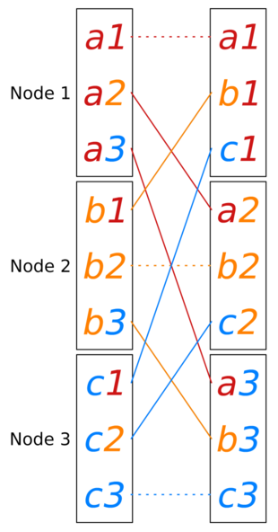

# AllToAll

In this project will be shown some algorithms that perform the operation of the AllToAll operation using the OpenMPI library. The algorithm were taken from scientific papers that have already dealt with the problem of optimization of the AllToAll communication. All-to-all is the most general communication pattern. For *0 <= i, j < p*, message *m(i,j)* is the message that is initially stored on node *i* and has to be delivered to node *j*.

## AllToALL Baseline

This is the baseline used to check the performance of the algorithms. It is the function **MPI_Alltoall** already existent in the OpenMPI library.

## AllToALL Datatype

This algorithm achieves the AllToAll operation by creating a custom type in MPI to send the information needed for each node in log(P) steps, where P is the number of processors. The type used is a MPI indexed block that is easier to manage insted of the circular one.
